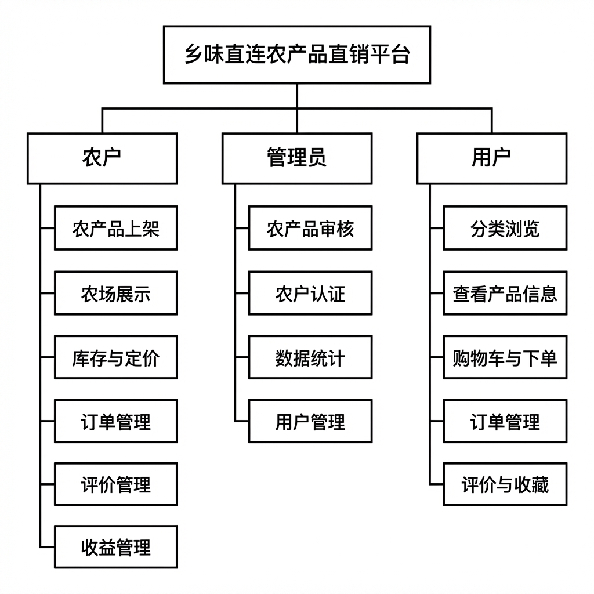
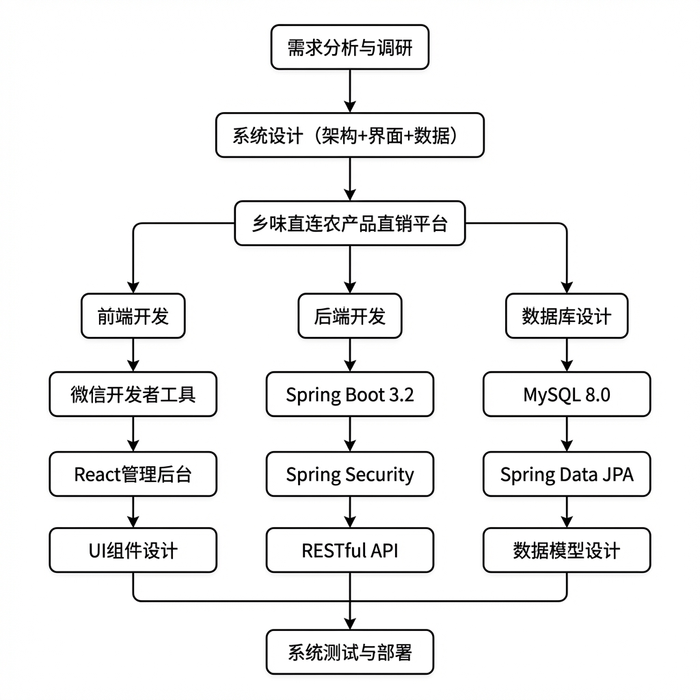

# 乡村农产品直销平台

## 项目概述

**乡村农产品直销平台**是一个连接乡村农户与城市消费者的农产品直销平台，旨在缩短农产品流通链条，让消费者能够直接从农户手中购买新鲜、优质的农产品，同时帮助农户提高收入、拓宽销售渠道。

### 项目定位
- **消费者端**：提供便捷的农产品购买体验，支持分类筛选、在线支付、订单管理、评价晒单
- **农户端**：提供产品上架、订单处理、收益管理、评价回复等功能
- **管理端**：提供平台运营管理，包括用户管理、产品审核、农户认证、数据统计等

---

## 技术架构

### 整体架构图

```
┌─────────────────────────────────────────────────────────────────┐
│                        用户层 (User Layer)                       │
├───────────────────┬─────────────────────┬───────────────────────┤
│   微信小程序       │     管理后台         │      API 文档          │
│   (miniprogram)   │   (admin-frontend)  │   (Swagger UI)        │
│   消费者/农户端    │     React + Antd    │                       │
└───────────────────┴─────────────────────┴───────────────────────┘
                              │
                              ▼
┌─────────────────────────────────────────────────────────────────┐
│                      后端服务层 (Backend)                        │
│                    Spring Boot 3.2.0 + Java 21                  │
├─────────────────────────────────────────────────────────────────┤
│  Controller 层   │  Service 层   │  Repository 层  │  Entity 层 │
│  RESTful API     │  业务逻辑     │   JPA 数据访问   │  数据模型   │
└─────────────────────────────────────────────────────────────────┘
                              │
                              ▼
┌─────────────────────────────────────────────────────────────────┐
│                      数据层 (Data Layer)                         │
│                       MySQL 8.0 数据库                           │
│              村庄数据库 (village) - 14 张核心表                   │
└─────────────────────────────────────────────────────────────────┘
```

### 技术栈详情

| 层级 | 技术 | 版本 | 说明 |
|-----|------|------|------|
| **前端 - 小程序** | 微信小程序原生 | - | 消费者和农户移动端 |
| **前端 - 管理后台** | React | 18.2.0 | 现代化前端框架 |
| | Ant Design | 5.12.5 | UI 组件库 |
| | React Router | 6.20.1 | 路由管理 |
| | Vite | 5.0.8 | 构建工具 |
| | Axios | 1.6.2 | HTTP 请求 |
| **后端** | Spring Boot | 3.2.0 | 应用框架 |
| | Java | 21 | 编程语言 |
| | Spring Data JPA | - | ORM 框架 |
| | Spring Security | - | 安全框架 |
| | JWT (jjwt) | 0.12.3 | 身份认证 |
| | Lombok | - | 代码简化 |
| | SpringDoc OpenAPI | 2.3.0 | API 文档 |
| **数据库** | MySQL | 8.0+ | 关系型数据库 |

---

## 项目目录结构

```
乡村农产品直销平台---乡村农产品直销平台/
├── miniprogram/                    # 微信小程序前端
│   ├── app.js                      # 小程序入口
│   ├── app.json                    # 小程序配置
│   ├── app.wxss                    # 全局样式
│   ├── project.config.json         # 项目配置
│   ├── components/                 # 公共组件
│   ├── pages/                      # 页面目录
│   │   ├── index/                  # 首页(角色选择)
│   │   ├── auth/                   # 认证模块
│   │   ├── user/                   # 消费者功能
│   │   ├── farmer/                 # 农户功能
│   │   └── common/                 # 公共页面
│   ├── utils/                      # 工具函数
│   └── images/                     # 图片资源
│
├── village/                        # 后端 Spring Boot 项目
│   ├── pom.xml                     # Maven 依赖配置
│   ├── src/main/java/com/village/
│   │   ├── VillageApplication.java # 启动类
│   │   ├── config/                 # 配置类
│   │   ├── controller/             # 控制器层
│   │   ├── entity/                 # 实体类
│   │   ├── repository/             # 数据访问层
│   │   ├── dto/                    # 数据传输对象
│   │   └── security/               # 安全相关
│   ├── src/main/resources/
│   │   ├── application.yml         # 应用配置
│   │   ├── village.sql             # 数据库初始化脚本
│   │   └── static/                 # 静态资源
│   ├── admin-frontend/             # 管理后台源码
│   └── upload/                     # 上传文件存储
```

---

## 系统架构图

### 功能架构图



### 开发流程图



---

## 角色功能详解

### 一、消费者角色功能

消费者是平台的购买方，可以浏览、购买农产品并进行评价。

#### （一）分类浏览与筛选

- **常规分类浏览**：按时令水果、五谷杂粮、农家干货等分类浏览产品
- **特色维度筛选**：按产地直供、现摘现发、有机认证、地理标志等特色标签筛选
- **产地筛选**：按产品产地进行筛选（如陕西洛川、黑龙江五常等）

#### （二）查看农产品信息

- **产品详情**：查看产品名称、价格、规格（按斤计价）、库存、产地
- **产品描述**：查看产品的详细描述和特色介绍
- **产品图片**：查看产品主图和多张展示图片
- **特色标签**：查看产品的有机认证、地理标志、当季鲜采等标签
- **农户信息**：查看供应农户的农场名称、所在地区、农场简介
- **农场实拍**：查看农户上传的农场实地照片

#### （三）评价系统

- **查看评价**：查看其他用户对产品的评价、评分
- **口感评价**：查看用户分享的口感体验
- **晒单图片**：查看用户收货后上传的实拍图片
- **评价统计**：查看产品的综合评分和评价数量

#### （四）购物功能

- **加入购物车**：将心仪的产品加入购物车
- **购物车管理**：调整商品数量、删除商品、清空购物车
- **收藏功能**：收藏喜爱的产品，方便下次购买

#### （五）下单支付

- **创建订单**：从购物车结算创建订单（按农户自动拆分为多个订单）
- **地址管理**：管理多个收货地址，设置默认地址
- **订单支付**：完成订单支付（模拟支付）
- **查看订单**：查看订单列表和订单详情
- **订单状态**：跟踪订单状态（待支付→已支付→已发货→已完成）
- **确认收货**：收到商品后确认收货
- **取消订单**：取消未支付的订单

#### （六）评价与分享

- **评价晒单**：收货后对商品进行评价，支持打分、文字评价、上传实拍图
- **口感分享**：分享产品的口感体验

#### （七）优惠券

- **领取优惠券**：在领券中心领取平台发放的优惠券
- **查看我的优惠券**：查看已领取的优惠券及使用状态

#### （八）个人中心

- **实名认证**：完成实名认证（姓名、身份证号）
- **个人资料**：查看和修改头像、昵称等个人信息
- **浏览足迹**：记录浏览产品的足迹数
- **收藏数量**：查看收藏的产品数量
- **积分系统**：完成订单后获得积分奖励

---

### 二、农户角色功能

农户是平台的供应方，可以上架产品、处理订单、管理收益。

#### （一）农产品上架

- **产品基本信息**：填写产品名称、描述、价格（按斤定价）、规格单位
- **产地信息**：填写产品产地（如陕西洛川）
- **产品分类**：选择产品分类（时令水果、五谷杂粮、农家干货等）
- **特色标签**：设置当季鲜采、现摘现发、有机认证、地理标志等标签
- **产品图片**：上传产品主图和多张展示图片
- **库存设置**：设置产品实时库存数量

#### （二）产品管理

- **我的产品**：查看已上架的产品列表
- **编辑产品**：修改产品信息、价格、库存、图片
- **删除产品**：下架删除产品
- **查看产品状态**：查看产品审核状态（待审核、已上架、已驳回、已下架）

#### （三）农场展示

- **农场信息**：填写农场名称、所在省市区、详细地址、农场简介
- **农场实拍**：上传农场实地照片，展示真实种植环境
- **农户认证**：提交认证申请，等待管理员审核

#### （四）订单管理

- **订单列表**：查看与本农户产品相关的订单
- **订单详情**：查看订单的收货地址、购买品类、数量、金额
- **订单发货**：确认发货，更新订单状态
- **订单统计**：查看待发货、已发货、已完成订单数量

#### （五）评价管理

- **查看评价**：查看消费者对本农户产品的评价
- **回复评价**：对用户评价进行回复

#### （六）收益管理

- **账户余额**：查看账户可用余额
- **提现申请**：申请余额提现
- **银行账户**：管理提现银行账户（添加/删除银行卡）
- **收益统计**：查看销售额、订单量等数据

#### （七）工作台仪表盘

- **数据概览**：产品总数、订单总数、总销售额、本月收益
- **待处理订单**：需要发货的订单提醒
- **产品库存预警**：低库存产品提醒
- **最新评价**：查看最新收到的用户评价

---

### 三、管理员角色功能

管理员负责平台运营，包括审核、管理、统计等工作。

#### （一）农产品审核

- **待审核列表**：查看待审核的产品列表
- **审核通过**：检查产品信息完整性后通过审核，产品上架
- **审核驳回**：驳回不合格产品，可附带驳回原因
- **屏蔽产品**：屏蔽虚假宣传、非乡村直供的违规产品

#### （二）农户管理

- **农户列表**：查看所有农户信息
- **农户认证**：审核农户的身份真实性、经营地址合规性
- **通过认证**：对符合条件的农户通过认证
- **驳回认证**：对不符合条件的农户驳回认证，反馈意见
- **编辑农户**：协助修改农户信息
- **禁用农户**：对违规农户进行禁用处理

#### （三）用户管理

- **用户列表**：查看所有消费者和农户用户
- **角色筛选**：按消费者/农户角色筛选用户
- **关键词搜索**：按手机号、姓名搜索用户
- **编辑用户**：协助修改用户基本信息
- **禁用用户**：禁用违规用户账号
- **警告用户**：对轻微违规用户发出警告
- **新增用户**：手动添加用户账号

#### （四）数据统计

- **平台概览**：商品总数、农户数量、用户数量、订单数量
- **交易统计**：总销售额、今日销售额
- **趋势分析**：最近7天的交易数据趋势图
- **最新动态**：平台最新的订单、产品上架、农户入驻动态

#### （五）订单管理

- **订单列表**：查看平台所有订单
- **订单详情**：查看订单的完整信息
- **订单搜索**：按订单号、用户等条件搜索

#### （六）优惠券管理

- **优惠券列表**：查看平台所有优惠券
- **新增优惠券**：创建新的优惠券（满减券、免运费券等）
- **编辑优惠券**：修改优惠券信息
- **优惠券统计**：查看优惠券领取和使用情况

#### （七）全表数据管理

- **用户表管理**：对用户数据的增删改查
- **产品表管理**：对产品数据的增删改查
- **订单表管理**：对订单数据的增删改查
- **评价表管理**：对评价数据的增删改查
- **地址表管理**：对地址数据的增删改查
- **其他表管理**：银行账户、提现记录、收藏记录等表的管理

---

## 系统功能接口

### 1. 认证模块 (Auth)

| 接口 | 方法 | 路径 | 说明 |
|-----|------|------|------|
| 登录 | POST | `/api/auth/login` | 手机号+密码登录，返回 JWT Token |
| 注册 | POST | `/api/auth/register` | 注册新用户（消费者/农户） |
| 实名认证 | POST | `/api/auth/realname` | 提交实名认证信息 |

### 2. 产品模块 (Product)

| 接口 | 方法 | 路径 | 说明 |
|-----|------|------|------|
| 产品列表 | GET | `/api/products` | 分页查询，支持分类/标签/产地筛选 |
| 产品详情 | GET | `/api/products/{id}` | 包含农户信息和评价统计 |
| 分类列表 | GET | `/api/products/categories` | 获取产品分类 |
| 特色标签 | GET | `/api/products/badges` | 获取特色标签 |

### 3. 购物车模块 (Cart)

| 接口 | 方法 | 路径 | 说明 |
|-----|------|------|------|
| 获取购物车 | GET | `/api/cart/{userId}` | 获取用户购物车 |
| 添加商品 | POST | `/api/cart` | 添加商品到购物车 |
| 更新数量 | PUT | `/api/cart/{id}` | 更新购物车商品数量 |
| 删除商品 | DELETE | `/api/cart/{id}` | 删除购物车商品 |
| 清空购物车 | DELETE | `/api/cart/user/{userId}` | 清空用户购物车 |

### 4. 订单模块 (Order)

| 接口 | 方法 | 路径 | 说明 |
|-----|------|------|------|
| 创建订单 | POST | `/api/orders` | 从购物车创建订单 |
| 用户订单列表 | GET | `/api/orders/user/{userId}` | 获取用户订单 |
| 订单详情 | GET | `/api/orders/{id}` | 获取订单详情 |
| 支付订单 | PUT | `/api/orders/{id}/pay` | 完成支付 |
| 发货 | PUT | `/api/orders/{id}/ship` | 农户发货 |
| 确认收货 | PUT | `/api/orders/{id}/receive` | 用户确认收货 |
| 取消订单 | PUT | `/api/orders/{id}/cancel` | 取消订单 |

### 5. 农户模块 (Farmer)

| 接口 | 方法 | 路径 | 说明 |
|-----|------|------|------|
| 工作台数据 | GET | `/api/farmers/{id}/dashboard` | 获取仪表盘数据 |
| 我的产品 | GET | `/api/farmers/products` | 获取农户产品列表 |
| 添加产品 | POST | `/api/farmers/products` | 添加新产品 |
| 更新产品 | PUT | `/api/farmers/products/{id}` | 更新产品信息 |
| 删除产品 | DELETE | `/api/farmers/products/{id}` | 删除产品 |
| 账户余额 | GET | `/api/farmers/{id}/balance` | 获取账户余额 |
| 提现申请 | POST | `/api/farmers/{id}/withdraw` | 申请提现 |
| 银行账户管理 | GET/POST/DELETE | `/api/farmers/{id}/accounts` | 管理银行账户 |
| 农场照片管理 | GET/POST/DELETE | `/api/farmers/{id}/photos` | 管理农场照片 |

### 6. 用户模块 (User)

| 接口 | 方法 | 路径 | 说明 |
|-----|------|------|------|
| 用户资料 | GET | `/api/users/{id}/profile` | 获取用户资料 |
| 更新资料 | PUT | `/api/users/{id}` | 更新用户资料 |
| 地址列表 | GET | `/api/users/{userId}/addresses` | 获取收货地址 |
| 添加地址 | POST | `/api/users/{userId}/addresses` | 添加收货地址 |
| 更新地址 | PUT | `/api/users/{userId}/addresses/{id}` | 更新地址 |
| 删除地址 | DELETE | `/api/users/{userId}/addresses/{id}` | 删除地址 |
| 收藏管理 | POST | `/api/users/{id}/favorites` | 添加/取消收藏 |

### 7. 优惠券模块 (Coupon)

| 接口 | 方法 | 路径 | 说明 |
|-----|------|------|------|
| 可用优惠券 | GET | `/api/coupons` | 获取可领取的优惠券 |
| 领取优惠券 | POST | `/api/coupons/{couponId}/claim` | 领取优惠券 |
| 我的优惠券 | GET | `/api/coupons/my` | 获取用户优惠券 |

### 8. 评价模块 (Review)

| 接口 | 方法 | 路径 | 说明 |
|-----|------|------|------|
| 产品评价 | GET | `/api/reviews/product/{productId}` | 获取产品评价列表 |
| 提交评价 | POST | `/api/reviews` | 提交评价 |
| 农户回复 | POST | `/api/reviews/{id}/reply` | 农户回复评价 |

### 9. 管理员模块 (Admin)

| 接口 | 方法 | 路径 | 说明 |
|-----|------|------|------|
| 待审核产品 | GET | `/api/admin/products/pending` | 获取待审核产品 |
| 通过产品 | PUT | `/api/admin/products/{id}/approve` | 审核通过 |
| 驳回产品 | PUT | `/api/admin/products/{id}/reject` | 审核驳回 |
| 屏蔽产品 | PUT | `/api/admin/products/{id}/block` | 屏蔽产品 |
| 待认证农户 | GET | `/api/admin/farmers/pending` | 获取待认证农户 |
| 通过认证 | PUT | `/api/admin/farmers/{id}/verify` | 农户认证通过 |
| 用户列表 | GET | `/api/admin/users` | 获取用户列表 |
| 禁用用户 | PUT | `/api/admin/users/{id}/disable` | 禁用用户 |
| 平台统计 | GET | `/api/admin/statistics` | 获取平台统计数据 |

---

## 数据库设计

### 数据库配置
```yaml
数据库名称: village
字符集: utf8mb4
连接端口: 3306
```

### 核心数据表

| 表名 | 说明 | 主要字段 |
|-----|------|---------|
| **user** | 用户表 | id, phone, password, role, real_name, avatar, status, points |
| **farmer** | 农户表 | id, user_id, farm_name, province, city, address, description, verified |
| **product** | 产品表 | id, farmer_id, name, price, unit, stock, category, origin, badge, image, status |
| **orders** | 订单表 | id, order_no, user_id, total_amount, status, reviewed, address_snapshot |
| **order_item** | 订单项表 | id, order_id, product_id, product_name, price, quantity, subtotal |
| **cart** | 购物车表 | id, user_id, product_id, quantity |
| **address** | 地址表 | id, user_id, name, phone, province, city, district, address, is_default |
| **coupon** | 优惠券表 | id, name, type, value, min_spend, start_time, end_time, total_count |
| **user_coupon** | 用户优惠券表 | id, user_id, coupon_id, status, get_time, use_time |
| **review** | 评价表 | id, user_id, product_id, order_id, rating, content, images, taste, reply |
| **bank_account** | 银行账户表 | id, farmer_id, bank_name, account_number, account_holder |
| **farm_photo** | 农场照片表 | id, farmer_id, url, description |
| **user_favorite** | 用户收藏表 | id, user_id, product_id |
| **withdrawal** | 提现记录表 | id, farmer_id, amount, status |

---

## 安全机制

### JWT 认证

```
1. 用户登录 → 验证账号密码 → 生成 JWT Token（有效期24小时）
2. 前端存储 Token (wx.setStorageSync)
3. 请求携带 Header: Authorization: Bearer <token>
4. 后端 JwtAuthenticationFilter 验证 Token
5. 验证通过 → 注入用户信息到 SecurityContext
```

### 权限控制

```java
// 公开接口（无需登录）
/api/auth/**              - 登录注册
/api/products/**          - 产品浏览
/api/reviews/product/**   - 产品评价查看

// 需要登录
/api/orders/**            - 订单操作
/api/cart/**              - 购物车操作
/api/admin/**             - 管理员操作
```

### 密码加密
- 算法：BCrypt
- 配置：`BCryptPasswordEncoder`

---

## API 文档

启动后端后，访问 Swagger UI 查看完整 API 文档：
```
http://localhost:8080/swagger-ui/index.html
```

---

## 系统特点

### 1. 三端协同
- 消费者小程序 + 农户小程序 + 管理后台 Web 端
- 统一后端 API 服务

### 2. 完整交易闭环
- 浏览 → 加购 → 下单 → 支付 → 发货 → 收货 → 评价

### 3. 多维度筛选
- 按分类、标签、产地多维度筛选产品
- 支持有机认证、地理标志等特色标签

### 4. 农户赋能
- 产品自主上架
- 订单实时管理
- 收益提现功能
- 评价互动回复

### 5. 平台管控
- 产品上架审核
- 农户资质认证
- 用户行为管理
- 数据统计分析

---

## 版本信息

| 组件 | 版本 |
|-----|------|
| 项目版本 | 1.0.0 |
| Spring Boot | 3.2.0 |
| Java | 21 |
| MySQL | 8.0+ |
| React | 18.2.0 |
| Ant Design | 5.12.5 |
